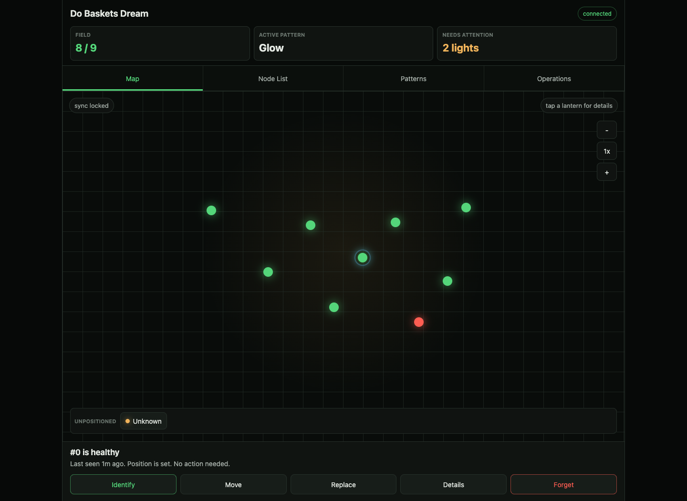
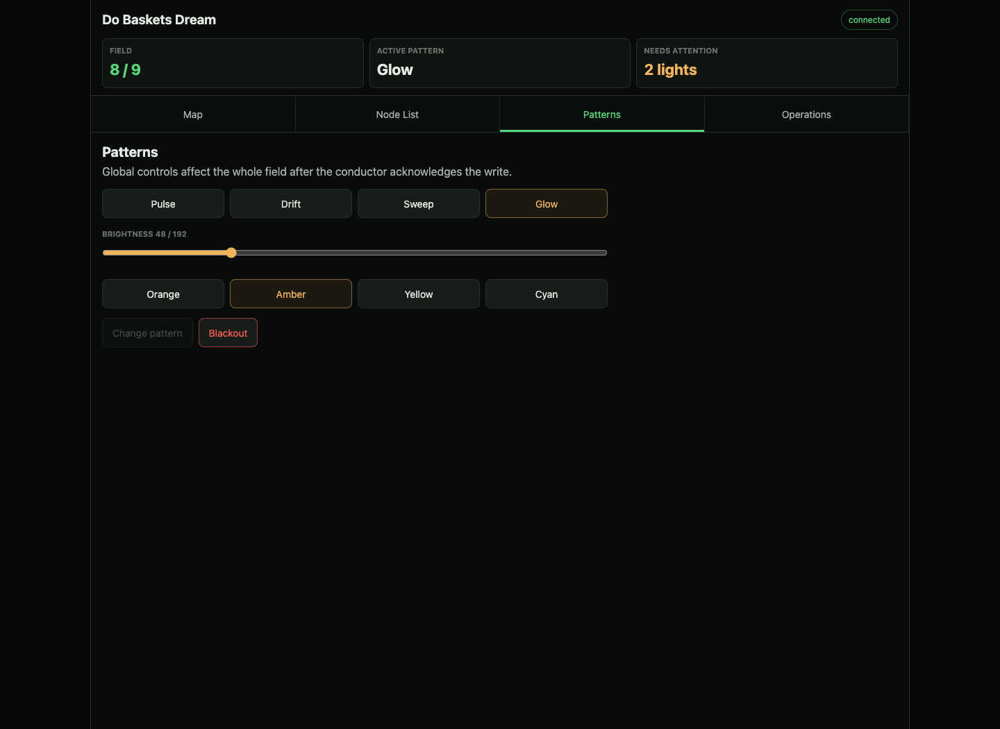
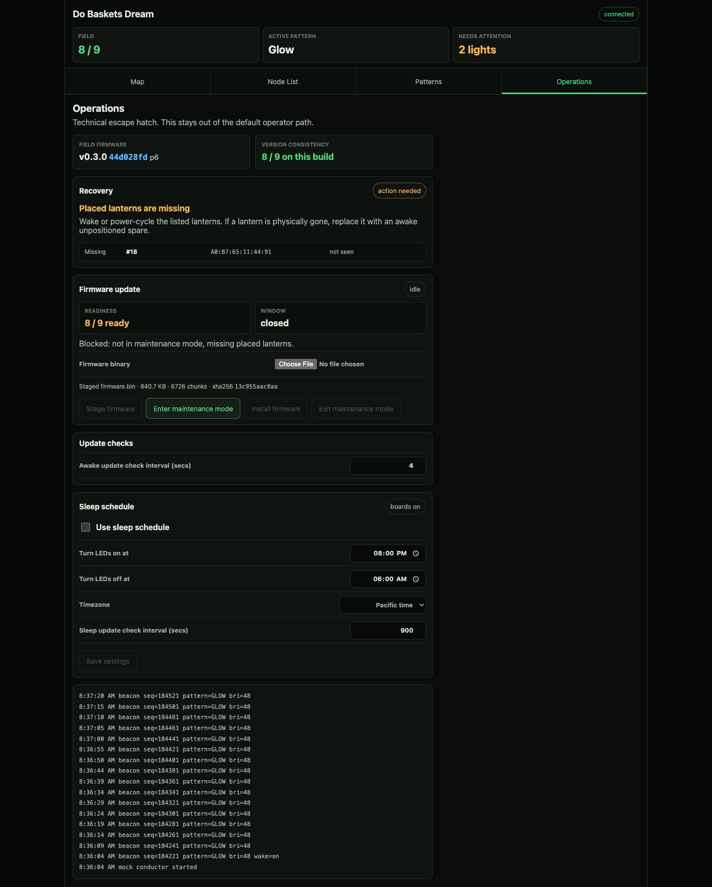
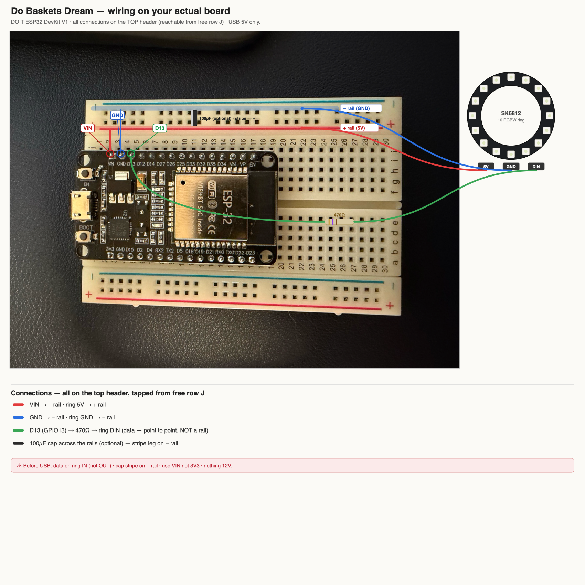
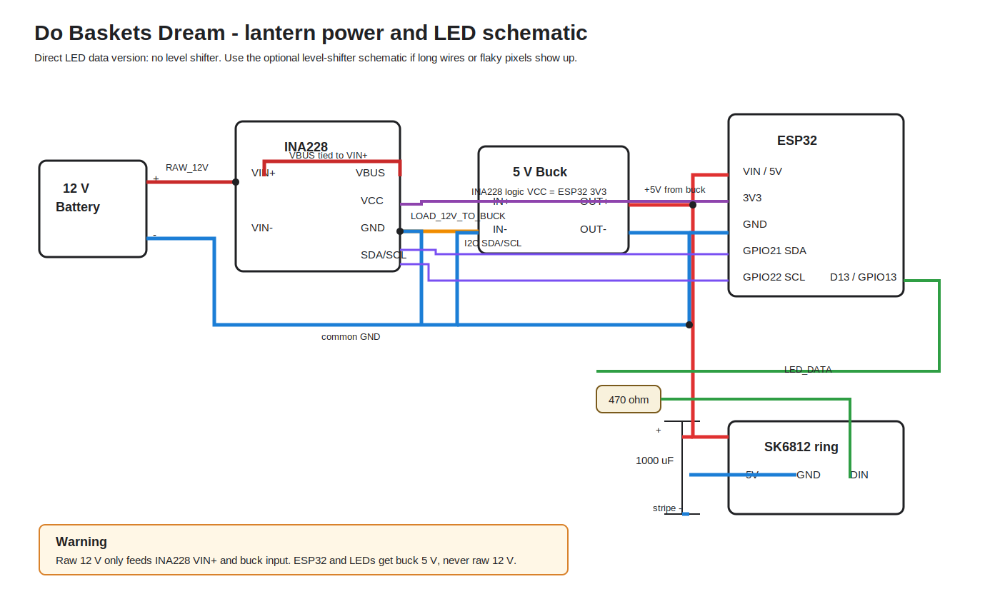
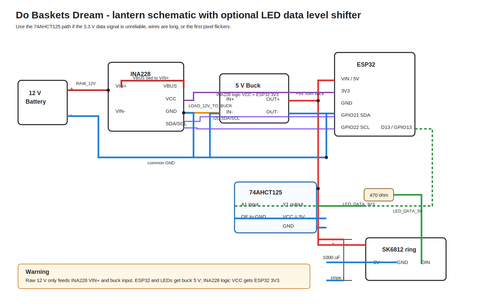

# LightWeave

Firmware and local control software for a synchronized field of battery-powered
ESP32 LED lanterns.

LightWeave turns many independent lanterns into one coordinated light
installation. A single conductor broadcasts time and show settings over ESP-NOW;
each performer lantern renders the current pattern locally from its stored field
position. The result is a wireless field that can play pulses, waves, palette
drifts, and calm glows without pushing per-lantern frames or depending on a router.

## Why adopt this project

- **One firmware image for the whole fleet.** Every ESP32 runs the same image.
  Runtime NVS settings decide whether a board is the conductor or a performer.
- **Wireless by design.** Lanterns coordinate over ESP-NOW, so there is no data
  wiring across the field and no Wi-Fi infrastructure dependency during the show.
- **Resilient synchronization.** Performers lock to the conductor clock, then
  free-run through missed beacons and re-lock when packets return. A dropped packet
  should not blank the field.
- **Position-aware patterns.** The conductor stores the field layout as
  `MAC -> (x, y)`. Each lantern evaluates `f(x, y, t)` locally, which makes waves
  and sweeps scale from a few nodes to a full installation without increasing
  radio bandwidth.
- **Offline operator UI.** A FastAPI control plane can run on a laptop or
  Raspberry Pi access point. Phones connect locally to place lanterns, change
  patterns, inspect field health, manage sleep settings, and run field-wide OTA.
- **Battery-conscious runtime.** The firmware supports radio duty cycling,
  light-sleep, daytime/deep-sleep scheduling, hard brightness caps, and optional
  INA228 power telemetry on reference nodes with UI-side battery SOC estimates.
- **Host-tested logic.** The subtle parts live in dependency-free headers with
  native unit tests, so sync math, pattern math, roster/table logic, power policy,
  and OTA helpers can be tested without hardware.

Current release: `0.3.0`. The bench system has been verified with one conductor
and two performers for sync, layout assignment, pattern control, runtime power
policy, and the local web control plane. Field-wide OTA is implemented and has
completed successful bench installs, including same-protocol mixed-firmware
recovery back to a consistent field. See [docs/HANDOFF.md](docs/HANDOFF.md) for
the exact latest state.

## System overview

```text
phone or laptop
    |
    | HTTP + WebSocket
    v
FastAPI control plane
    |
    | USB serial JSON
    v
conductor ESP32
    |
    | ESP-NOW beacons: clock + pattern + power policy + layout updates
    v
performer ESP32 lanterns
    |
    | local render: color = f(x, y, synced_time)
    v
SK6812 RGBW rings
```

The conductor is authoritative for the field table and live show settings. The
control server is an admin surface, not a runtime dependency: once settings are
saved to the conductor, the field keeps running if the laptop or Pi is unplugged.

## Captive web UI

The control plane is built for an offline deployment: a Raspberry Pi can run its
own Wi-Fi access point and serve the UI locally, while talking to the conductor
over USB serial. In development, the same app runs on a laptop and defaults to a
mock conductor.

### Map and placement



### Pattern controls



### Operations and OTA



## Hardware

Each performer is an ESP32, one 16-pixel SK6812 RGBW ring, a 12 V LiFePO4 battery,
and a 5 V buck regulator. The bench wiring currently uses `GPIO13` for LED data
because it is convenient on the DevKit layout; the pin is centralized in
[include/config.h](include/config.h).








| Function | Current part | Connection |
|---|---|---|
| MCU | ESP32-WROOM-32 bench boards; FireBeetle 2 ESP32-E target for production | one shared firmware image |
| LEDs | 16x SK6812 RGBW ring | `GPIO13` / `D13` through 470 ohm series resistor |
| LED power conditioning | bulk capacitor across ring 5 V/GND | bench schematic shows 100 uF; production BOM uses 1000 uF |
| Dusk/fallback sensor | phototransistor or LDR divider | `GPIO34` / ADC1 |
| Battery sense | 47 k / 10 k divider from 12 V line | `GPIO35` / ADC1 |
| Power telemetry | optional INA228 reference node only | I2C, default ESP32 pins `SDA=21`, `SCL=22` |
| Power | 12 V LiFePO4 -> 5 V buck | 5 V to ESP32 VIN and ring; common ground required |

Important hardware constraints:

- Use ADC1 pins for analog sensors. ESP32 ADC2 silently stops working while the
  Wi-Fi/ESP-NOW radio is active.
- Keep all grounds common. The LED data line is invalid without shared ground.
- Use a real data USB cable when flashing.
- Read [docs/FLASHING.md](docs/FLASHING.md) before uploading firmware to new
  boards; factory-fresh boards need a one-time `erase_flash`, and USB serial
  device names can shuffle when boards are replugged.

See [docs/BOM.md](docs/BOM.md) for the production bill of materials and pilot
batch notes.

## Features

### Firmware

- ESP-NOW conductor/performer roles with one image and runtime role selection.
- 64-bit microsecond clock sync with free-run behavior on missed beacons.
- Pattern broadcast with `pattern_id`, brightness, palette/params, and sequence
  tracking.
- Patterns: Pulse, Palette Drift, Sweep, Solid test mode, and Glow.
- MAC-keyed roster and conductor-authoritative layout table.
- Persistent role, position, pattern, brightness, and power policy in NVS.
- Radio duty cycling, CPU light-sleep support, and schedule-driven deep-sleep
  policy.
- Optional INA228 energy telemetry from reference nodes back to the conductor.
- Manual maintenance-mode OTA transport over serial to conductor, then ESP-NOW to
  performers.
- Human serial CLI plus newline-delimited JSON serial protocol for the web UI.

### Control plane

- FastAPI HTTP/WebSocket API with a static browser UI.
- Mock conductor for UI development without hardware.
- Real serial adapter for a USB-attached conductor.
- Map view with placed lanterns, missing nodes, and unpositioned spares.
- Node actions: identify, move/place, forget, and replace.
- Pattern controls with conductor acknowledgements before writes are treated as
  saved.
- Operations view for firmware consistency, recovery state, OTA staging/install,
  runtime power policy, and sparse power monitoring. Battery capacity defaults
  to the 153.6 Wh TalentCell pack and can be changed in the UI; metered nodes can
  be manually synced to 100% after charging.

## Quick start

Install PlatformIO, then build or test the firmware:

```bash
pio run -e devkitc
pio run -e firebeetle
pio test -e native
```

Flash a board only after reading the flashing runbook:

```bash
pio run -e devkitc -t upload --upload-port /dev/cu.usbserial-XXXX
pio device monitor --port /dev/cu.usbserial-XXXX
```

Useful serial commands:

```text
info
role conductor|performer
roster
table
assign <mac> <x> <y>
forget <mac>
pattern <n>
bri <n>
param <i> <v>
power
power reset
```

Run the web control plane in mock mode:

```bash
.venv/bin/python -m uvicorn control.app:app --host 127.0.0.1 --port 8000
```

Run it against a real conductor:

```bash
CONTROL_CONDUCTOR=serial \
CONTROL_SERIAL_PORT=/dev/cu.usbserial-XXXX \
.venv/bin/python -m uvicorn control.app:app --host 127.0.0.1 --port 8000
```

Then open `http://127.0.0.1:8000/`.

## Repo guide

- [docs/HANDOFF.md](docs/HANDOFF.md) - current state, known risks, and next task.
- [docs/ARCHITECTURE.md](docs/ARCHITECTURE.md) - design decisions and status tags.
- [docs/PROJECT_BRIEF.md](docs/PROJECT_BRIEF.md) - original project brief and
  constraints.
- [docs/FLASHING.md](docs/FLASHING.md) - flashing, monitoring, and hardware
  gotchas.
- [docs/CONTROLPLANE.md](docs/CONTROLPLANE.md) - API/control-plane design.
- [docs/BOM.md](docs/BOM.md) - pilot and production hardware planning.
- [control/README.md](control/README.md) - control-plane setup and tests.

## Development rule

New firmware logic should be host-testable. Keep hardware-independent logic in
headers under [include/](include/) and add cases in [test/test_logic/](test/test_logic/).
Keep `pio test -e native` green before shipping changes.
